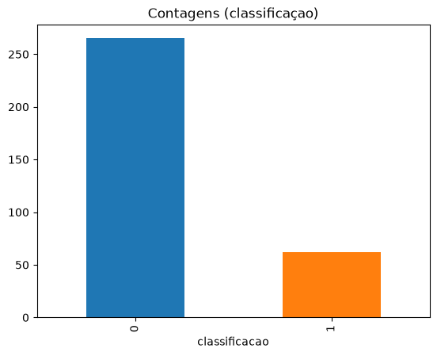
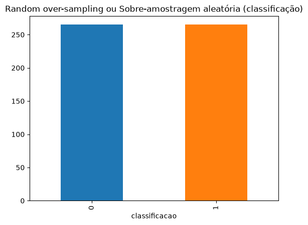
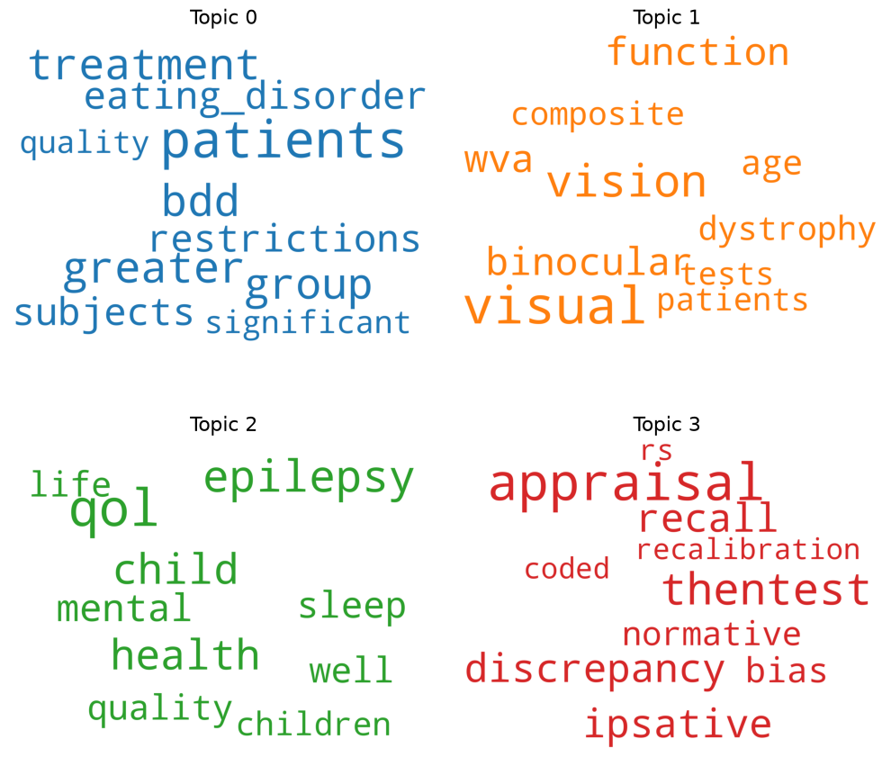
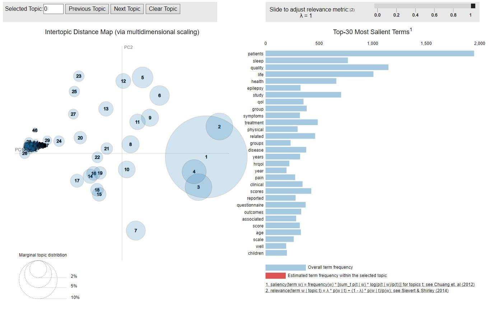
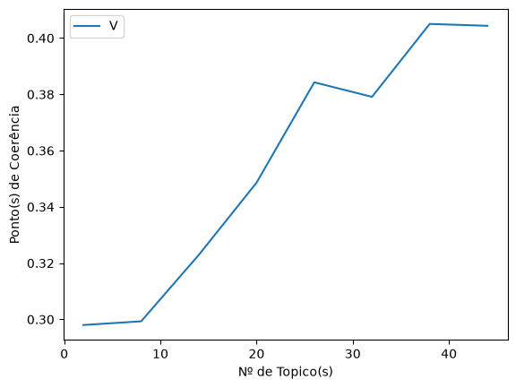
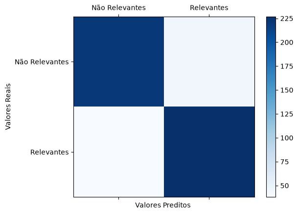
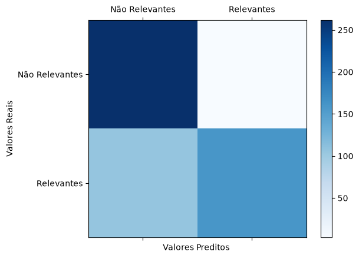

# Aprendizagem Automática para Apoio a Revisão Sistemática de Literatura

> Projeto de mestrado em Engenharia Informática e de Telecomunicações
> Universidade Autónoma de Lisboa "Luís de Camões" — Julho de 2020
> Autor: **Michael Dionísio Borges** · Orientador: **Prof. Doutor Gonçalo Ramiro Valadão Matias**

📄 **[Ler a dissertação de mestrado original, tal como defendida (PDF, 96 páginas)](Dissertacao_30001171_Michael_Borges_2020.pdf)**
📄 **[Ler a dissertação em inglês — edição reconstruída (PDF, 80 páginas)](Thesis_30001171_Michael_Borges_2020_EN.pdf)**
🇺🇸 **[Read this document in English](../README.md)**

---

## 1. O problema, em linguagem simples

Imagine que uma equipa de investigadores de medicina precisa de responder a uma pergunta
científica. Antes de começar, eles têm de ler **tudo** o que já foi publicado sobre o assunto.
A isso chama-se *revisão sistemática de literatura*.

Foi exatamente isso que aconteceu aqui. A equipa pesquisou no **PubMed** (a maior base de
artigos médicos do mundo) com uma lista de palavras-chave sobre qualidade de vida e saúde,
e o motor devolveu **17.132 artigos**.

O problema é aritmético e cruel:

| | |
|---|---|
| Artigos devolvidos pela busca | 17.132 |
| Artigos que a equipa conseguiu ler e classificar à mão | **327** |
| Tempo médio para avaliar 1 artigo (só título + resumo) | ~10 minutos |
| Tempo gasto nesses 327 artigos | **54,5 horas** |
| Tempo estimado para os 17.132 artigos, no mesmo ritmo | **~118 dias** (quase 4 meses) |

Ou seja: a parte mais cansativa da investigação não é investigar — é **separar o que vale a
pena ler do que não vale**. A essa separação chama-se *triagem*.

**A pergunta desta dissertação foi:** será que um computador consegue aprender com os 327
artigos que os humanos já classificaram, e depois fazer essa triagem sozinho no resto?

A resposta curta: **sim, com ressalvas** — e o resto deste documento conta como.

### Por que estas soluções, e não outras?

Esta é uma pergunta justa em 2026, quando a resposta instintiva seria "manda os resumos para
um modelo de linguagem". Em 2019–2020, quando a investigação foi feita, esse caminho não
existia na prática. O contexto da época era:

- **BERT tinha pouco mais de um ano** e exigia GPUs que um mestrando não tinha em casa.
  O ChatGPT só apareceria dois anos depois.
- **O corpus é minúsculo**: 327 textos rotulados. Modelos neurais grandes precisam de
  milhares de exemplos; com 327, eles decoram em vez de aprender.
- **A interpretabilidade era um requisito, não um luxo.** Um investigador não aceita um
  "não leia este artigo" sem justificação. Precisa de ver *porquê*.

Por isso a escolha recaiu sobre um par de técnicas clássicas, maduras e explicáveis:

- **LDA (Latent Dirichlet Allocation)** — descobre, sem supervisão, os "temas escondidos"
  do conjunto de artigos. É o que dá a explicação legível: *"este artigo pertence ao tópico
  72, cujas palavras-chave são cancer, treatment, …"*.
- **SVM (Support Vector Machine)** — o classificador supervisionado. É reconhecidamente o
  melhor desempenho da sua categoria quando há **poucos dados e muitas dimensões** (que é
  exatamente a forma de um problema de texto). Traça uma fronteira entre "relevante" e
  "não relevante" e fica-se por aí.
- **TF-IDF** — transforma texto em números, dando mais peso às palavras que distinguem um
  artigo dos outros e menos às que aparecem em todo o lado.
- **Oversampling** — para resolver o desequilíbrio do corpus (explicado na secção 3).

Nada disto está obsoleto: continua a ser a escolha certa para corpora pequenos onde é
preciso justificar cada decisão.

---

## 2. A triagem feita pela equipa (e o que há na pasta `data/`)

Antes de qualquer código, houve trabalho humano. E foi um trabalho cuidadoso.

A equipa definiu primeiro **regras explícitas** do que entra e do que sai (por exemplo:
*incluir* estudos com "patient or observer PROMs"; *excluir* artigos que não estejam em
inglês, ou que sejam revisões). Depois, **duas investigadoras leram a mesma amostra de
artigos de forma independente** — a Carlota e a Rita (as iniciais "CP, RF, SB" nos nomes
dos ficheiros são as dos avaliadores). Quando as duas discordavam, havia uma terceira
planilha para **resolver o desacordo e fixar o rótulo final**.

Essa dupla leitura independente é o que torna os rótulos confiáveis o suficiente para
treinar um modelo. É o chamado *ground truth* — a "verdade" contra a qual a máquina é medida.

A pasta [data/](../data/) guarda esse trabalho:

### `data/csv/`

| Ficheiro | O que é |
|---|---|
| `ArticleSelection_Sample_CP_RF_SB.csv` | Os **critérios de inclusão e exclusão** acordados pela equipa. É a documentação das regras que os humanos seguiram ao ler. Não contém artigos — contém o *método*. |

### `data/dat/` — os textos em bruto

Ficheiros binários no formato `pickle` do Python (uma forma de guardar objetos Python
diretamente em disco).

| Ficheiro | O que é |
|---|---|
| `records.dat` | O **banco de dados bruto dos artigos**, tal como vieram do PubMed. Um dicionário que liga o ID de cada artigo aos seus metadados — sobretudo o título (`'TI'`) e o resumo (`'AB'`). É daqui que sai o texto que alimenta todo o pipeline. |
| `testIndicesClassesTitlesAbstracts.dat` | O **conjunto de teste**, já pré-processado e congelado: uma lista em que cada item é `[ID, rótulo real, título, abstract]`. Existe para que a avaliação do modelo seja sempre feita sobre exatamente os mesmos dados, sem ter de reconstruí-los. |

### `data/xlsx/` — a rotulagem manual

| Ficheiro | O que é |
|---|---|
| `Carlota_V1.xlsx` / `Rita_V1.xlsx` | As classificações **individuais e independentes** de cada investigadora. |
| `Decision.xlsx` | A planilha de **consenso**, onde as divergências entre avaliadoras foram resolvidas. |
| `ArticleSelection_Sample_CP_RF_SB.xlsx` | O ***ground truth* consolidado**. O notebook lê a aba `Indexes` deste ficheiro: coluna 0 = ID do artigo, coluna 9 = classificação final. É este o ficheiro que o modelo usa para aprender. |
| `ArticleSelection_Sample_CP_RF_SB_copia.xlsx` | Cópia de segurança do anterior. |
| `df_data.xlsx` / `df_records.xlsx` | **Exportações geradas pelo próprio código** (`DataFrames` do pandas), juntando textos e rótulos em tabela. Servem só para inspeção humana — para conseguir ver com os próprios olhos o que está a ser dado ao modelo. |

O corpus final é uma lista de quatro campos por artigo:

```
[ índice ] [ classificação ] [ título ] [ abstract ]
     0            1              2           3
```

Note-se o que ficou **de fora**: o texto completo dos artigos. A triagem — humana e
automática — usa apenas **título e resumo**. É uma decisão deliberada: é assim que os
revisores reais trabalham, e é o que mantém a tarefa exequível.

---

## 3. Resultados, passo a passo

Cada etapa abaixo corresponde a um bloco do notebook
[notebooks/SVM_LDA_0.2v_passe_25_numTopic_100_enviado_professor.ipynb](../notebooks/SVM_LDA_0.2v_passe_25_numTopic_100_enviado_professor.ipynb).

### Etapa 1 — O corpus está desequilibrado

Primeiro gráfico do notebook, e já uma má notícia:

```
Classificação 0 (não relevante): 265
Classificação 1 (relevante)....:  62
Proporção......................: 4,27 : 1
```



> **Como ler:** cada barra é uma categoria. À esquerda (azul), os 265 artigos que os
> revisores marcaram como **não relevantes**; à direita (laranja), os 62 **relevantes**.
> A barra azul é mais de 4× mais alta — e é essa desproporção visual que define o problema
> da etapa seguinte.

**Raciocínio:** de cada ~5 artigos lidos, só 1 interessava. Isso é normal numa revisão
sistemática — mas é veneno para um classificador. Um modelo preguiçoso pode dizer "não
relevante" a tudo e acertar 81% das vezes, sem ter aprendido nada. Pior: os erros caem
todos do lado que mais dói — **descartar um artigo que era relevante**.

### Etapa 2 — Equilibrar com *oversampling*

```
Classificação 0: 265
Classificação 1: 265
Proporção......: 1,0 : 1   →   530 artigos
```



> **Como ler:** o mesmo gráfico, depois do *oversampling*. As duas barras têm agora
> exatamente a mesma altura (265 cada). Nenhum artigo foi removido — a barra da classe
> minoritária subiu, por replicação estatística de 203 artigos "relevantes". O corpus passou
> de 327 para 530 artigos.

**Raciocínio:** em vez de deitar fora artigos "não relevantes" (*undersampling*) — o que,
com 327 textos, seria desperdiçar informação que custou 54 horas a produzir —, replicou-se
estatisticamente a classe minoritária, sintetizando 203 artigos "relevantes" adicionais.
Com um corpus tão pequeno, **a escolha foi preservar informação, não descartá-la**.

> Esta decisão é a que mais pesa no resultado final. A comparação está na Etapa 7.

### Etapa 3 — Limpar o texto

Tokenização → remoção de *stopwords* → **lematização** (reduzir cada palavra à sua forma
base) → formação de bigramas e trigramas.

**Raciocínio:** optou-se por *lematização* em vez de *stemming*. O *stemming* corta as
palavras à força ("studies" → "studi"); a lematização percebe a gramática ("studies" →
"study"). Como o passo seguinte junta palavras em pares e trios, **expressões partidas ao
meio destruiriam o sentido** — e é precisamente o sentido que o LDA precisa de encontrar.
Mantiveram-se apenas substantivos, adjetivos, verbos e advérbios.

### Etapa 4 — Descobrir os temas escondidos (LDA)

O LDA recebe um dicionário e um *Bag of Words* e devolve tópicos — cada um uma lista
ponderada de palavras. Foram treinados dois modelos: um com o **LDA do gensim**
(`LdaMulticore`) e outro com o **MALLET**, uma implementação em Java reconhecidamente mais
precisa na amostragem.

Exemplo real de tópico descoberto (MALLET):

```
Tópico 0: 0.054*"epilepsy" + 0.042*"life" + 0.029*"related" + 0.029*"quality" + 0.025*"health" …
Tópico 3: 0.054*"treatment" + 0.031*"group" + 0.026*"patients" + 0.017*"cancer" + 0.012*"qol" …
```

**Raciocínio:** isto é legível por um humano. O tópico 0 é claramente *epilepsia e qualidade
de vida*; o 3 é *tratamento oncológico*. É esta legibilidade que falta aos modelos
"caixa-preta" e que justifica o LDA neste projeto.

A mesma informação, em forma visual — cada painel é um tópico, e o tamanho de cada palavra
é o seu peso dentro dele:



> **Como ler:** o **Tópico 1** (laranja) é inequívoco — *visual, vision, binocular,
> dystrophy*: trata-se de **visão**. O **Tópico 2** (verde) é *epilepsy, qol, child, health*:
> **qualidade de vida infantil na epilepsia**. O **Tópico 3** (vermelho) é mais abstrato —
> *appraisal, recall, bias, discrepancy* — e corresponde a artigos sobre **metodologia de
> questionários**, não a uma doença. Já o **Tópico 0** (azul) mistura *treatment, patients,
> eating_disorder, bdd, greater, significant*: é um tópico **difuso**, sem tema claro.
> Tópicos assim são normais e esperados — são o "resto" que o modelo não conseguiu separar,
> e a sua existência é um dos sinais usados para avaliar se o número de tópicos está certo.

#### A visualização interativa: pyLDAvis



> **Como ler o painel da esquerda** (*Intertopic Distance Map*): cada **bolha é um tópico**.
> O **tamanho** indica que fatia do corpus esse tópico cobre; a **distância** entre bolhas
> indica o quanto os temas são diferentes entre si (tópicos próximos partilham vocabulário).
> Os eixos PC1 e PC2 não têm significado próprio — são apenas a projeção em duas dimensões
> de um espaço com muito mais.
>
> **O que este gráfico diz:** a bolha **1** é enorme e domina o lado direito — é o tema
> central do corpus (qualidade de vida em doentes). As bolhas **2, 3 e 4**, sobrepostas a
> ela, são variações do mesmo assunto. Mais importante é o **amontoado à esquerda**, junto à
> origem: dezenas de bolhas minúsculas e empilhadas umas sobre as outras. **Esse é o sinal de
> alarme** — são tópicos que o modelo criou mas que não têm substância nem identidade
> própria. É precisamente o sintoma de "tópicos a mais" que motiva a etapa seguinte.
>
> **O painel da direita** lista os 30 termos mais salientes do corpus (*patients, sleep,
> quality, life, health…*). Ao clicar numa bolha, as barras passam a mostrar, a vermelho, a
> frequência desses termos **dentro** do tópico escolhido — é assim que se confirma do que
> trata cada tópico.
>
> *(Figura da dissertação, p. 64. A visualização é interativa em HTML e não gera imagem
> estática; no notebook corresponde à célula de execução nº 25.)*

### Etapa 5 — Quantos tópicos são "os certos"?

Não há resposta teórica. A forma prática é treinar vários modelos e medir a **coerência**
(o quanto as palavras de cada tópico realmente aparecem juntas na realidade). O gráfico de
coerência vs. número de tópicos mostra a curva a subir e depois a achatar.

| Nº de tópicos | 2 | 8 | 14 | 20 | 26 | 32 | 38 | 44 |
|---|---|---|---|---|---|---|---|---|
| Coerência — dissertação (2020) | 27% | 33% | 33% | 36% | 35% | 36% | 37% | **40%** |
| Coerência — reexecução (2026) | 30% | 30% | 32% | 35% | 38% | 38% | **41%** | 40% |



> **Como ler:** eixo horizontal = número de tópicos testado; eixo vertical = coerência
> obtida. A curva **sobe depressa até cerca de 20–26 tópicos** e depois **achata** (note-se
> o patamar entre 26 e 32, e de novo depois dos 38). Cada ponto da linha custou treinar um
> modelo LDA completo — é por isso que esta célula é a mais demorada do notebook.
>
> *(Gráfico gerado na reexecução de 2026; corresponde à linha inferior da tabela acima.)*

**Raciocínio:** o valor escolhido **não é o máximo da curva**, e isso é intencional. Escolhe-se
o ponto onde o crescimento *abranda* — porque a partir daí os tópicos novos deixam de ser
temas distintos e passam a ser fatias repetidas dos anteriores (as mesmas palavras-chave a
reaparecer em tópicos vizinhos são o sinal de alarme). Na dissertação original, k = 20 foi
o ponto de inflexão escolhido.

O modelo é também avaliado por **perplexidade** (quanto mais baixa, menos "surpreso" o
modelo fica com textos novos) e pela comparação direta entre as coerências do LDA puro e do
LDA + MALLET.

### Etapa 6 — Do tópico para a decisão (TF-IDF + SVM)

O LDA produz um corpus enriquecido: cada artigo passa a ter, além do texto, o seu tópico
dominante e a respetiva percentagem de contribuição. Esse corpus entra no SVM.

- **TF-IDF** converte o texto em vetores (`min_df=5`, `max_df=0.8`, `ngram_range=(1,2)`).
- **Grid search** testa combinações de hiperparâmetros e escolhe a melhor por validação cruzada.
- **Validação cruzada k-fold com K = 4**: o corpus é dividido em 4 partes; cada uma é, à vez,
  o conjunto de teste, enquanto as outras 3 treinam. Resultado: 354 artigos para treino e
  176 para teste, em cada volta.

Melhor configuração encontrada:

```
{'C': 1, 'gamma': 1, 'kernel': 'linear'}
```

**Raciocínio:** `kernel='linear'` significa que uma **linha reta** chega para separar
relevantes de não relevantes. Isso é uma boa notícia — fronteiras mais complicadas, com tão
poucos dados, decorariam o treino em vez de generalizar. E `K = 4` em vez do habitual
`K = 10` porque, com 530 artigos, fatias mais finas dariam conjuntos de teste pequenos
demais para se confiar no resultado.

### Etapa 7 — O resultado que importa: equilibrado vs. desequilibrado

Esta é a conclusão central da dissertação. As duas matrizes de confusão, lado a lado:

**Corpus equilibrado** (530 artigos)

```
                     Previsto: Não Rel.   Previsto: Relevante
Real: Não Relevante         216                   49          ← 49 falsos positivos
Real: Relevante              33                  232          ← 33 falsos negativos
```

**Corpus desequilibrado** (327 artigos, sem *oversampling*)

```
                     Previsto: Não Rel.   Previsto: Relevante
Real: Não Relevante          81                   82
Real: Relevante              94                   70          ← 94 falsos negativos
```

A mesma matriz equilibrada, como o notebook a desenha — quanto **mais escura** a célula,
maior o número de artigos nela:



> **Como ler:** as linhas são a **verdade** (o que os revisores decidiram), as colunas são o
> **palpite do modelo**. A **diagonal** — canto superior esquerdo e canto inferior direito —
> são os **acertos**, e é por isso que ambos estão a azul-escuro. Os dois cantos claros são
> os erros, e são poucos. **Um classificador perfeito teria a diagonal escura e os outros
> dois cantos completamente brancos** — o que esta matriz quase consegue.
>
> *(Reexecução de 2026: `[[221, 44], [38, 227]]`.)*

A mesma célula treina também, para comparação, um classificador **Naive Bayes** sobre
exatamente os mesmos dados:



> **Como ler — e por que é interessante:** repare que o canto superior direito está quase
> **branco**: o Naive Bayes quase nunca marca como "relevante" um artigo que não é (98,1% de
> precisão). Mas olhe agora para a **linha de baixo**: as duas células têm tons médios e
> parecidos, ou seja, **ele divide os artigos verdadeiramente relevantes quase ao meio** —
> cerca de 106 deles vão parar à coluna errada. É um *recall* de apenas 60%.
>
> Traduzindo: o Naive Bayes é **cauteloso de mais**. Quando diz "relevante", acerta quase
> sempre; o problema é que deixa escapar dois em cada cinco artigos que importavam. Para uma
> revisão sistemática, isso é o pior tipo de erro — e é exatamente por isso que **o SVM foi
> o classificador escolhido**, apesar de ter precisão mais baixa (83,8%).

> ⚠️ **Nota de leitura do notebook:** na impressão em texto, a matriz sob o título
> "classificador naveis bayes" mostra por engano os números do SVM (a variável errada é
> passada ao `print`). **O gráfico está correto** — é desenhado a partir da matriz do Naive
> Bayes, tal como as métricas apresentadas. O lapso é do código original de 2020 e foi
> mantido como está.

| Métrica | Não balanceado | Balanceado |
|---|---|---|
| Precisão | 48,9% | **96,6%** |
| *Recall* (renovação) | 40% | **63%** |
| Acurácia | 49% | **81%** |
| F1-Score | 45% | **56%** |

**Raciocínio — e é aqui que tudo se liga:** olhe para o canto inferior esquerdo das duas
matrizes. No corpus desequilibrado, **94 artigos relevantes foram descartados como
irrelevantes**. Numa revisão sistemática, esse é *o* erro que não se pode cometer: um falso
positivo custa 10 minutos de leitura desperdiçada; um falso negativo custa um artigo
importante que nunca ninguém voltará a ver. Com o equilíbrio, esse número cai para 33.

Isto é o que valida a decisão tomada lá atrás, na Etapa 2.

### Etapa 8 — Ajudar o humano a ler mais depressa

Duas camadas finais, que não classificam nada — apenas poupam tempo ao revisor:

- **Sumarização** dos *abstracts* (TextRank, via gensim), para que o revisor tenha uma
  noção do artigo antes de o ler por inteiro.
- **Reconhecimento de Entidades Nomeadas** (spaCy), destacando no resumo pessoas,
  organizações, números e datas.

**Raciocínio:** a dissertação é explícita neste ponto, e vale a pena repeti-lo — **o
classificador não substitui o revisor humano**. Ele reordena a fila, põe à frente o que
provavelmente interessa, e devolve ao investigador o tempo que ele gastaria a descartar
artigos óbvios.

### O resultado em uma frase

> **118 dias de triagem manual estimados → ~45 minutos de processamento automático** para os
> mesmos 17.132 artigos, com 96,6% de precisão na amostra validada.

---

## 4. Notas sobre esta reexecução (2026)

O notebook foi portado para correr novamente, seis anos depois. Os números reproduzem-se de
perto, mas **não são idênticos** aos da dissertação — o que é esperado: as bibliotecas
mudaram de versão e vários passos têm componente aleatória (*oversampling*, embaralhamento
do k-fold, amostragem do LDA).

| | Dissertação (2020) | Reexecução (2026) |
|---|---|---|
| Melhor coerência | 40% (k=44) | 41% (k=38) |
| Perplexidade | −14,74 | −7,51 |
| Melhores hiperparâmetros SVM | `C=1, gamma=1, linear` | `C=1, gamma=1, linear` (idêntico) |
| Matriz de confusão (equilibrado) | `[[216, 49], [33, 232]]` | `[[221, 44], [38, 227]]` |

As conclusões qualitativas mantêm-se todas — e, notavelmente, o *grid search* voltou a
escolher exatamente os mesmos hiperparâmetros.

**Sobre os números e as imagens da secção 3:** as métricas de desempenho citadas são as da
**dissertação original**, por serem as que foram defendidas. Já os **gráficos incorporados
foram exportados da reexecução de 2026**, por serem os que o notebook produz hoje — com
duas exceções assinaladas na própria legenda: a curva de coerência traz as duas séries lado
a lado, e o mapa de bolhas do pyLDAvis vem da dissertação (p. 64), por ser uma visualização
interativa que não gera imagem estática.

---

## 5. Decisões técnicas

### Por que existe o `ldamallet_compat.py`

O notebook treina tópicos com o **MALLET** — um pacote em Java, em
`tools/mallet-2.0.8/` — porque o MALLET produz tópicos de melhor
qualidade do que a implementação pura do LDA. O gensim nunca implementou o MALLET: apenas
oferecia um *invólucro* (`wrapper`) que escrevia ficheiros em disco, chamava o binário Java
por linha de comando e lia o resultado de volta.

Essa classe vivia em `gensim.models.wrappers.LdaMallet`. **O módulo
`gensim.models.wrappers` foi removido por completo no gensim 4.0**, sem substituto
embutido. O código original deixou simplesmente de arrancar:

```python
from gensim.models.wrappers import LdaMallet   # ModuleNotFoundError no gensim 4.x
```

Havia três saídas possíveis:

1. **Fixar o projeto no gensim 3.8.3** — o que arrastaria consigo um NumPy e um SciPy
   antigos, e tornaria impossível usar Python moderno.
2. **Trocar o MALLET pelo LDA puro do gensim** — mas isso alteraria os resultados e deixaria
   de reproduzir a dissertação, que compara explicitamente os dois.
3. **Trazer a classe para dentro do projeto.** ← foi esta.

[notebooks/ldamallet_compat.py](../notebooks/ldamallet_compat.py) é a classe `LdaMallet`
*vendorizada* a partir do gensim 3.8.3, sem alterações de lógica. Depende apenas de APIs do
gensim que continuam a existir no 4.x (`utils`, `matutils`, `basemodel`), por isso funciona
com a versão atual. Mantém-se a licença original (**GNU LGPL v2.1**, Radim Řehůřek).

É uma peça pequena e estável — o formato de ficheiros do MALLET 2.0.8 não muda desde 2015 —,
e permite que o notebook de 2020 corra sobre a pilha científica de 2026 **sem mexer na
ciência**.

### Por que Python 3.12

O projeto está fixado em **3.12.14** ([`.python-version`](../.python-version),
[`pyproject.toml`](../pyproject.toml)). A razão é prática: 3.12 é a versão mais recente em que
**toda** a pilha necessária — gensim, spaCy, scikit-learn, pandas, pyLDAvis — está
disponível em conjunto, com *wheels* pré-compiladas e sem necessidade de compilar extensões
em C a partir do código-fonte.

Subir mais depende sempre do elo mais fraco da cadeia, e aqui há vários pacotes com
extensões nativas. Descer, por outro lado, não traz vantagem nenhuma. O 3.12 é o ponto onde
o projeto é ao mesmo tempo **moderno e instalável com um único comando** — que, para um
trabalho que já tem seis anos, é exatamente a propriedade que interessa.

---

## 6. Como executar

**Pré-requisitos:** [uv](https://docs.astral.sh/uv/) e um **Java Runtime** (o MALLET é Java —
testado com OpenJDK 21).

```bash
# 1. Instalar dependências (cria o .venv e instala o Python 3.12.14 se necessário)
uv sync

# 2. Modelo de língua inglesa do spaCy, usado na lematização e no NER
uv run python -m spacy download en_core_web_sm

# 3. Descarregar o MALLET 2.0.8 — software de terceiros, não incluído neste repositório
curl -LO http://mallet.cs.umass.edu/dist/mallet-2.0.8.tar.gz
mkdir -p tools && tar -xzf mallet-2.0.8.tar.gz -C tools && rm mallet-2.0.8.tar.gz
chmod +x tools/mallet-2.0.8/bin/mallet

# 4. Abrir o notebook
uv run jupyter lab notebooks/
```

> O MALLET não está versionado aqui por serem 26 MB de binários de terceiros; a página de
> download é [mallet.cs.umass.edu](http://mallet.cs.umass.edu/download.php), caso o link acima
> mude. O único código relativo ao MALLET que pertence a este projeto é o invólucro em
> [notebooks/ldamallet_compat.py](../notebooks/ldamallet_compat.py) (ver secção 5).

No notebook, a **primeira célula de configuração** deteta o sistema operativo e define os
caminhos para `data/xlsx/`, `data/dat/` e para o binário do MALLET. **Ajuste esses caminhos
para a sua máquina antes de executar o resto.**

> O notebook usa também o pacote `wordcloud` numa célula de visualização; se não o tiver,
> instale-o com `uv add wordcloud` ou salte essa célula.

---

## 7. Estrutura do projeto

```
TM/
├── data/
│   ├── csv/     Critérios de inclusão e exclusão
│   ├── dat/     Artigos em bruto (pickle) + conjunto de teste congelado
│   └── xlsx/    Rotulagem manual, consenso e ground truth
├── docs/
│   ├── Dissertacao_30001171_Michael_Borges_2020.pdf   Dissertação original (PT)
│   ├── Thesis_30001171_Michael_Borges_2020_EN.pdf     Edição inglesa (reconstruída)
│   ├── thesis-en-src/            Fontes Typst + figuras da edição inglesa
│   ├── README.pt.md              Este documento (versão portuguesa)
│   └── images/                   Gráficos exportados do notebook
├── notebooks/
│   ├── SVM_LDA_0.2v_passe_25_numTopic_100_enviado_professor.ipynb
│   └── ldamallet_compat.py       Wrapper do MALLET (ver secção 5)
├── tools/
│   └── mallet-2.0.8/             MALLET (Java) — descarregado à parte, não versionado
├── pyproject.toml
└── .python-version
```

---

## 8. Glossário rápido

| Termo | Em linguagem simples |
|---|---|
| **Revisão sistemática (RS)** | Ler e resumir *tudo* o que já foi publicado sobre uma pergunta científica, seguindo regras explícitas. |
| **Triagem** | Separar, pelo título e resumo, os artigos que vale a pena ler dos que não. |
| ***Corpus*** | O conjunto de textos com que se trabalha. |
| ***Ground truth*** | Os rótulos atribuídos por humanos, que servem de "gabarito" à máquina. |
| **TF-IDF** | Transformar texto em números, valorizando as palavras que distinguem um texto dos outros. |
| **LDA** | Algoritmo que descobre sozinho os temas escondidos numa coleção de textos. |
| **SVM** | Classificador que traça a melhor fronteira possível entre duas categorias. |
| ***Oversampling*** | Replicar exemplos da categoria rara para equilibrar os dados. |
| **Coerência** | Medida de quão "fazem sentido juntas" as palavras de um tópico. Mais alta = melhor. |
| **Perplexidade** | Medida de quão "surpreso" o modelo fica ao ver textos novos. Mais baixa = melhor. |
| **Falso negativo** | Um artigo relevante que o modelo descartou. **O erro mais caro aqui.** |
| **Validação cruzada (k-fold)** | Dividir os dados em k partes e testar k vezes, para não depender de uma divisão sortuda. |
| **NER** | Reconhecimento de entidades: destacar automaticamente pessoas, locais, datas e números num texto. |

---

## Licença e créditos

O trabalho académico é de **Michael Dionísio Borges** (Universidade Autónoma de Lisboa, 2020).
O código deste repositório é distribuído sob a **Licença MIT** — ver [LICENSE](../LICENSE).

Os dados em [data/](../data/) e os PDFs da dissertação em [docs/](.) são material de
investigação, não código: cite a dissertação se os utilizar.

[notebooks/ldamallet_compat.py](../notebooks/ldamallet_compat.py) deriva do gensim 3.8.3
(© Radim Řehůřek) e mantém a licença **GNU LGPL v2.1**.
O [MALLET](http://mallet.cs.umass.edu/) é distribuído sob a **Common Public License**.
